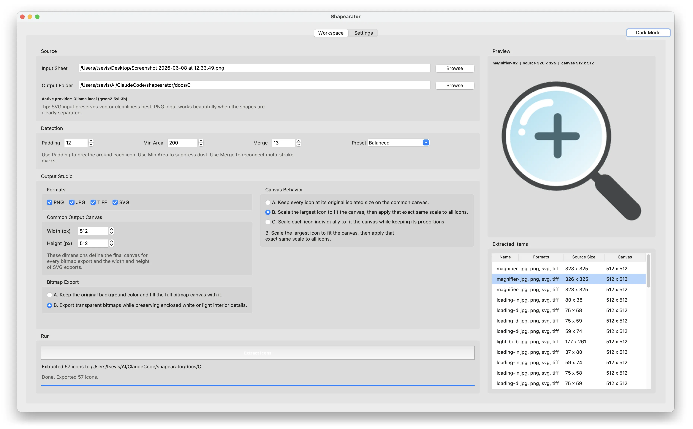
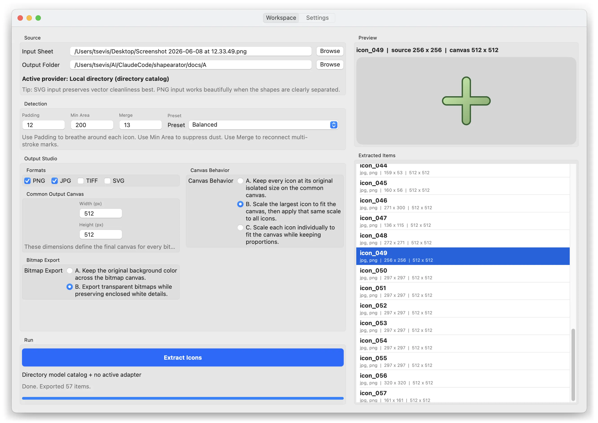
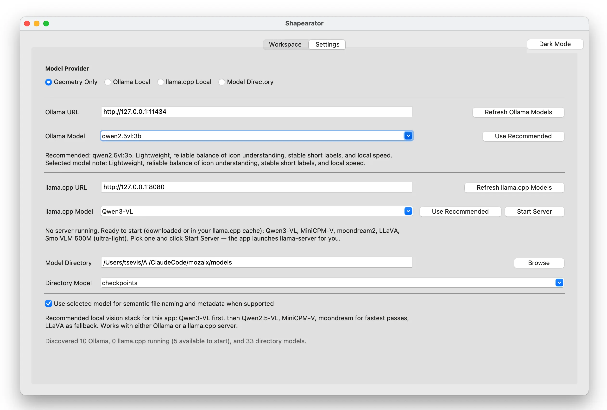

# Shapearator

Created by Charis Tsevis.

Current version: `0.3.2`



Shapearator turns a single sheet full of shapes or icons into a tidy set of
individually cropped, cleanly named, well-organized files. Instead of manually
cropping, renaming, and sorting every asset by hand, Shapearator detects each
shape, separates it, normalizes it onto a shared canvas, and writes structured
exports with per-icon metadata.

It is a **local-first** Python app with both a desktop GUI and a full-featured CLI.
It reads `PNG` and `SVG` sheets and exports cleaned icons as `PNG`, `JPG`, `TIFF`,
and `SVG`. Optional **semantic naming** gives each icon a meaningful filename
(`heart.png` instead of `icon_003.png`) using a local vision model — through
**either Ollama or llama.cpp**, whichever you already run.

## Highlights

- Detects and separates isolated icons from raster or vector sheets
- Normalizes every export onto a shared output canvas with selectable scaling
- Exports bitmap and vector formats in a single run, with per-icon metadata JSON
- **Semantic naming with two interchangeable local backends: Ollama and llama.cpp**
- **One-click / one-command first-run model download** so a fresh clone just works
- 100% local and offline-friendly by design — no cloud endpoints

## Two Backends, One Experience

Shapearator treats **Ollama** and **llama.cpp** as first-class, interchangeable
providers. Pick whichever local inference stack you have — or install both and
switch freely. Under the hood they satisfy a single vision-client contract, so
results and behavior stay consistent across backends.

| | Ollama | llama.cpp |
|---|---|---|
| Interface | native `/api/generate` | OpenAI-compatible `/v1/chat/completions` |
| Default endpoint | `http://127.0.0.1:11434` | `http://127.0.0.1:8080` |
| Model management | `ollama pull` (many models) | GGUF weights + `mmproj` (one per server) |
| Server | always-on daemon | app can launch `llama-server` for you |

Both are guarded to local endpoints only, both get automatic retry on cold starts,
and both are checked by a pre-run **preflight** that reports clearly if a server is
down, a model is missing, or a loaded model is not vision-capable.

## Interfaces

- **GUI desktop app** — best for visual workflows, previews, and settings
- **CLI** — best for automation, scripting, and repeatable batch runs
- **macOS packaged app** — available upon request

GUI-only features: live preview, extracted-item browser, file/folder pickers, and a
light/dark appearance toggle. The CLI covers extraction, export, metadata, settings,
provider selection, semantic naming, model setup, and progress reporting.


*Shapearator for macOS includes a native desktop workspace for local extraction and export workflows.*


*The macOS build also includes a native settings experience for local providers, Ollama and llama.cpp configuration, and model management.*

Distribution note: a packaged macOS `.dmg` exists separately from this repository.
The current installer is roughly `1.8 GB`, so it is impractical to host in-repo; the
macOS build is available upon request.

## Supported Input and Output

- **Input:** `PNG`, `SVG`
- **Output:** `PNG`, `JPG`, `TIFF`, `SVG`

`SVG` input is the highest-fidelity route when available. Raster-to-`SVG` output
depends on content: monochrome shapes are traced to vector paths, while colored or
non-monochrome content is embedded as raster inside the `SVG`.

## Installation

Requires **Python 3.10+**.

```bash
git clone https://github.com/tsevis/shapearator.git
cd shapearator
pip install -r requirements.txt
```

Python dependencies (`requirements.txt`): `Pillow`, `opencv-python`, `numpy`,
`requests`, and `huggingface_hub` (used to download llama.cpp GGUF models).

`./run.sh` also installs these automatically the first time it cannot import them.

System tools required by parts of the pipeline (install separately, on `PATH`):

- `inkscape`
- `potrace`

Optional local model backends (either or both — only needed for semantic naming):

- **Ollama** — a running daemon: <https://ollama.com>
- **llama.cpp** — the `llama-server` binary on `PATH`: <https://github.com/ggml-org/llama.cpp>

## First-Run Model Setup

Geometry extraction needs no model at all. Semantic naming needs a local vision
model, and Shapearator can fetch one for you on first run.

**GUI:** the first time you launch with no local vision model available, a setup
dialog appears. It detects which backends you have, lists the recommended models
with their download sizes, and downloads the ones you tick — Ollama models via
`ollama pull`, llama.cpp models as GGUF weights + `mmproj` projector from Hugging
Face into `models/`. You can skip and set up later from the Settings tab.

**CLI:** download the default model for whatever backend you have, then exit:

```bash
python shapearator.py --setup
```

Or grab every recommended model for the available backend(s):

```bash
python shapearator.py --setup-all
```

Everything stays local and offline after download. For llama.cpp, the app can also
launch `llama-server` against the downloaded weights, so you never have to start it
by hand.

## Running the App

### GUI

```bash
./run.sh          # from the repository root
# or
python main.py
```

### CLI

```bash
python shapearator.py sheet.png --output-dir exports
python shapearator.py --help      # all options
```

## CLI Examples

Geometry-only extraction:

```bash
python shapearator.py sheet.png \
  --output-dir exports \
  --formats png svg \
  --output-width 512 --output-height 512 \
  --canvas-mode uniform_to_largest
```

Detection preset with a single override:

```bash
python shapearator.py sheet.png \
  --output-dir exports \
  --detection-preset "Tiny Details" \
  --merge-gap 11 \
  --formats png jpg svg
```

Semantic naming with local **Ollama**:

```bash
python shapearator.py sheet.png \
  --output-dir exports \
  --provider ollama \
  --ollama-url http://127.0.0.1:11434 \
  --ollama-model qwen2.5vl:3b \
  --semantic-naming \
  --formats png svg
```

Semantic naming with a local **llama.cpp** server:

```bash
# start a server first (or let the app do it):
#   llama-server -hf ggml-org/Qwen2.5-VL-3B-Instruct-GGUF --port 8080
python shapearator.py sheet.png \
  --output-dir exports \
  --provider llamacpp \
  --llamacpp-url http://127.0.0.1:8080 \
  --llamacpp-model qwen2.5-vl \
  --semantic-naming \
  --formats png svg
```

Load defaults from config and persist the resolved run settings:

```bash
python shapearator.py sheet.svg --use-config --save-config --output-dir exports
```

## Extraction Controls

Canvas modes:

- `original` — keep each isolated icon at its extracted size on the shared canvas
- `uniform_to_largest` — scale the largest icon to fit, then apply that scale to all
- `individual_fit` — scale each icon independently to fit the canvas

Bitmap export modes:

- `keep_background` — preserve the detected original background color
- `transparent_preserve_interior` — transparent output while preserving interior light detail when possible

Detection presets: `Balanced`, `Tiny Details`, `Loose Sketches`, `Bold Shapes`.
Explicit `--padding`, `--min-area`, and `--merge-gap` override the preset.

## Local Model Providers

Provider modes:

- `geometry` — classical local extraction only (no model)
- `ollama` — local Ollama endpoint for semantic naming
- `llamacpp` — local llama.cpp (`llama-server`) endpoint for semantic naming
- `directory` — local model catalog selection stored in settings for future adapters

Constraints:

- Ollama and llama.cpp must both point to local endpoints (`localhost`, `127.0.0.1`, `::1`)
- cloud endpoints are intentionally out of scope
- semantic naming is active with `provider=ollama` or `provider=llamacpp`
- the directory provider is for local model organization; it is not yet a direct inference backend

Recommended vision-model families (usable with either backend; sizes approximate):

| Family | Ollama tag | Hugging Face GGUF repo | Notes |
|---|---|---|---|
| Qwen2.5-VL 3B | `qwen2.5vl:3b` | `ggml-org/Qwen2.5-VL-3B-Instruct-GGUF` | Best overall (default) |
| MiniCPM-V 2.6 | `minicpm-v:latest` | `openbmb/MiniCPM-V-2_6-gguf` | Strong second opinion |
| moondream2 | `moondream:latest` | `ggml-org/moondream2-20250414-GGUF` | Fastest lightweight |
| LLaVA 1.6 (7B) | `llava:7b` | `ggml-org/llava-1.6-mistral-7b-gguf` | General fallback |
| SmolVLM 500M | — | `ggml-org/SmolVLM-500M-Instruct-GGUF` | Ultra-light / smoke test |

For llama.cpp, each model is its GGUF weights plus the matching `--mmproj` vision
projector; the first-run installer downloads both.

## Output Layout

Each run writes only the selected export folders plus metadata:

```text
exports/
  png/
  jpg/
  tiff/
  svg/
  metadata/
```

Each metadata JSON includes exported paths by format, source bounds and size, output
canvas size, provider and model details, vector export mode, dominant color and
palette, and (when available) the semantic label, tags, and confidence.

## Configuration

User settings live in `config/settings.json` and can hold defaults for provider
selection, Ollama URL/model, llama.cpp URL/model, models directory, directory-model
selection, semantic naming, formats, output dimensions, canvas mode, bitmap export
mode, detection parameters, and the last input/output locations.

A clean template is provided at `config/settings.example.json`; copy it to
`config/settings.json` to pre-seed defaults (the app also creates the file on first
save). The GUI reads and writes it automatically. The CLI uses it only with
`--use-config` and saves it only with `--save-config`. `config/settings.json` is
gitignored so personal paths never get committed. A first-run marker is stored in
`config/setup_state.json` (gitignored), and downloaded llama.cpp weights live in
`models/` (gitignored).

## Testing

The test suite uses `pytest` and runs fully offline (network and servers are mocked):

```bash
pip install pytest
pytest -q
```

Coverage includes the shared vision layer, provider parity (Ollama vs llama.cpp),
retry/backoff, preflight, the model catalog, the download installer, and the
first-run flow.

## Repository Map

- `main.py` — GUI entrypoint
- `shapearator.py` — CLI entrypoint
- `run.sh` — launches the GUI (and installs dependencies on first run)
- `services/` — shared extraction engine, model backends, settings, and setup logic
- `gui/` — desktop interface
- `tests/` — pytest suite
- `docs/` — sample inputs, outputs, and working assets (mostly not source code)

For a full user guide, see [MANUAL.md](MANUAL.md). For a detailed repository map, see
[FILE_STRUCTURE.md](FILE_STRUCTURE.md).

## Limitations

- Works best when symbols on a sheet are reasonably separated.
- GUI preview is available only in the desktop app.
- The directory provider does not yet perform direct inference.
- Some raster-to-vector exports remain embedded-raster `SVG` when tracing would lose fidelity.

## Troubleshooting

- `Required binary 'inkscape' was not found on PATH.` — install `inkscape` and ensure it is on your shell `PATH`.
- `Required binary 'potrace' was not found on PATH.` — install `potrace` and ensure it is on your shell `PATH`.
- `Ollama provider requires a local endpoint...` — point `--ollama-url` to `localhost`, `127.0.0.1`, or `::1`.
- `llama.cpp provider requires a local endpoint...` — point `--llamacpp-url` to `localhost`, `127.0.0.1`, or `::1`.
- llama.cpp model dropdown is empty — start `llama-server` with a vision model (and its `--mmproj`), then click `Refresh llama.cpp Models`, or run `python shapearator.py --setup`.
- Semantic naming does nothing — confirm the preflight line in the CLI header reports `ready`; start the backend or download a model with `--setup`.
- Very small marks disappear — lower `min-area` or try the `Tiny Details` preset.
- Multiple strokes split apart — raise `merge-gap` or try the `Loose Sketches` preset.
- Exports inconsistent in scale — use `uniform_to_largest` for a shared visual scale.

## License

Released under the MIT License. See [LICENSE](LICENSE).
