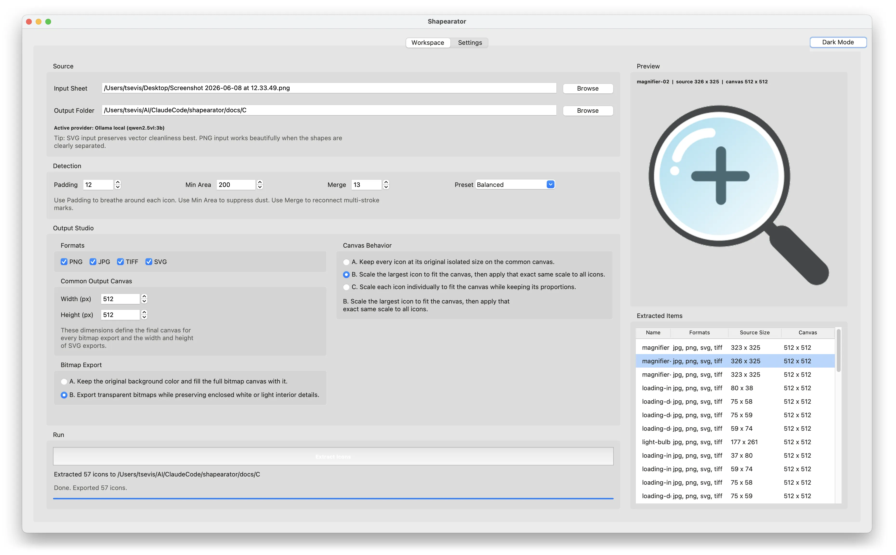

# Shapearator

Created by Charis Tsevis.

Current version: `0.4.7`



## The problem this solves

Designers and illustrators rarely draw one icon at a time. You fill a page with
forty sketches, or lay a whole set out on a single artboard, or scan a sheet of
marks made with a brush. The artwork is finished — but it is all in one file,
and it is useless that way.

What you actually need is forty separate assets: each one cropped to its own
drawing, sitting on a consistent canvas so they line up in a grid, exported in
whatever formats the project wants, and named something you can find again in
six months. Producing that by hand means selecting, cropping, centring,
exporting and typing a filename forty times over — an afternoon of mechanical
work where the only real skill involved is patience, and where the results are
never quite consistent.

**Shapearator does that pass for you.** Give it the sheet; it finds every
individual mark or object, separates it, centres it on a shared canvas, writes
out each format you asked for, and records what it did. A page of sketches
becomes an organized, reusable asset library in one run.

The naming is the part that usually surprises people. Rather than
`icon_001.png`, `icon_002.png`, a local vision model can *look* at each
extracted icon and name it for what it is — `lightbulb.png`, `heart.png`,
`magnifier.png` — and record tags and a confidence score alongside it. That
turns the output from a numbered pile into something searchable.

All of it runs on your own machine. The vision models are local, the endpoints
are hard-restricted to `localhost`, and your artwork is never uploaded
anywhere. Shapearator is a **local-first** Python app with a desktop GUI and a
full CLI: it reads `PNG` and `SVG` sheets, exports `PNG`, `JPG`, `TIFF` and
`SVG`, and drives **either Ollama or llama.cpp** — whichever you already run —
for naming.

---

## Contents

- [What it does](#what-it-does) · [Install](#install) · [Run](#run)
- [Reading a sheet](#reading-a-sheet) — how icons are found in PNG and SVG
- [Exports](#exports) — formats, canvas, and the run manifest
- [Semantic naming](#semantic-naming) — the two model backends
- [CLI reference](#cli-reference) · [Configuration](#configuration)
- [Development](#development) · [Troubleshooting](#troubleshooting)

---

## What it does

- Finds and separates individual icons in a raster or vector sheet
- Normalizes every export onto a shared canvas with selectable scaling
- Writes bitmap and vector formats in one run, with per-icon metadata JSON
- Names icons semantically using a local vision model, on either backend
- Downloads a suitable model for you on first run
- Replaces a previous export cleanly, without touching your own files

### Interfaces

| | Best for |
| --- | --- |
| **GUI** (`main.py`) | visual workflows, live preview, browsing results |
| **CLI** (`shapearator.py`) | automation, scripting, repeatable batches |
| **[MacShapearator](https://github.com/tsevis/MacShapearator)** | a native macOS app that bundles this engine |

Everything except live preview, the results browser and the appearance toggle is
available from the CLI.

---

## Install

Requires **Python 3.10+**.

```bash
git clone https://github.com/tsevis/shapearator.git
cd shapearator
pip install -r requirements.txt
```

Two external tools must be on your `PATH`:

```bash
brew install inkscape potrace     # macOS
```

`inkscape` measures and rasterizes vector artwork; `potrace` traces monochrome
bitmaps into vector paths. `./run.sh` installs the Python dependencies
automatically the first time it cannot import them.

Optional, and only for semantic naming — install either, or both:

- **Ollama** — a running daemon: <https://ollama.com>
- **llama.cpp** — `llama-server` on your `PATH`: <https://github.com/ggml-org/llama.cpp>

---

## Run

```bash
./run.sh                                    # GUI
python main.py                              # GUI, directly

python shapearator.py sheet.png --output-dir exports
python shapearator.py sheet.svg --output-dir exports --formats png svg
```

---

## Reading a sheet

### PNG sheets

Ink is separated from paper using both luminance and colour distance, so
coloured marks on coloured paper are found as reliably as black on white.
Nearby marks are merged into one icon, which is what lets a multi-stroke
drawing stay a single asset. Three settings drive it:

| Setting | Raise it to | Lower it to |
| --- | --- | --- |
| `padding` | leave more air around each icon | crop tighter |
| `min-area` | ignore more dust and specks | keep smaller marks |
| `merge-gap` | reconnect strokes that sit further apart | split touching icons |

Four presets cover the usual cases: `Balanced`, `Tiny Details`,
`Loose Sketches`, `Bold Shapes`.

### SVG sheets

Shapearator reads the artwork's own structure first.

**Grouped artwork is taken as authored.** If the sheet is one `<g>` per icon —
how most vector icon sets are built — each group becomes one icon exactly as
drawn. A drum kit made of nineteen separate paths stays one icon. No detection
tuning is involved, and the settings above have no effect.

**Wrapper layers are seen through.** A sheet exported from Illustrator or Figma
with all its artwork inside a single `Layer_1` behaves like a flat one,
including when that layer carries a transform.

**Loose shapes still cluster visually.** A hand-drawn sheet, where one icon is
several disconnected strokes, is grouped the same way a `PNG` is — the settings
above apply to that case.

Each extracted icon carries the definitions it actually references —
gradients, clip paths, masks, filters, patterns, markers and `<use>`/`<symbol>`
targets — resolved transitively, so a gradient inheriting stops from another
gradient brings both. Definitions the icon does not use are left out. Document
`<style>` rules are copied whole, since deciding which CSS applies would mean
reimplementing the cascade.

---

## Exports

`SVG` input is the highest-fidelity route. Raster-to-`SVG` depends on content:
monochrome shapes are traced to real vector paths, while colour artwork is
embedded as a bitmap inside the `SVG`.

Canvas scaling has three modes: keep each icon at its original size, scale
everything by the factor that fits the largest icon (the default, which keeps
relative sizes truthful), or fit each icon individually.

### Output layout

```text
exports/
  png/  jpg/  tiff/  svg/
  metadata/
  .shapearator-manifest.json
```

### Reusing an output folder

A run is staged inside the output folder and moved into place only after
extraction, naming and metadata have all succeeded. If anything fails, the
staged work is discarded and the previous export is left exactly as it was.

`.shapearator-manifest.json` records every file the last run wrote, and it is
the only thing a later run will delete:

- **No manifest** — a folder Shapearator has not written before — nothing is
  deleted. Your own files stay, and the run reports how many it left in place.
- **Manifest present** — exactly the files it lists are replaced. A smaller run
  leaves no stale icons behind, and a format you drop between runs is cleaned
  up.

Files you add yourself are never tracked and never removed. Delete the manifest
and Shapearator forgets the folder, reverting to add-only behaviour.

### Metadata

Each icon gets a JSON sidecar, and the same payload is embedded in exported
`SVG`s: source bounds and size, canvas size, exported paths, vector mode,
dominant colour and palette, plus the semantic label, tags and confidence when
a model named it.

Metadata is written to be published. Exports get zipped and handed to other
people, so nothing in them describes the machine that made them:
`source_file` is the sheet's name, `formats` are relative to the export folder
(which also keeps them valid after the folder moves), and any recorded error
text has the home directory replaced with `~`.

---

## Semantic naming

Shapearator treats **Ollama** and **llama.cpp** as interchangeable. Both satisfy
one vision-client contract, so behaviour is consistent whichever you use.

| | Ollama | llama.cpp |
| --- | --- | --- |
| Interface | native `/api/generate` | OpenAI-compatible `/v1/chat/completions` |
| Default endpoint | `http://127.0.0.1:11434` | `http://127.0.0.1:8080` |
| Models | `ollama pull` | GGUF weights + `mmproj` |
| Server | always-on daemon | the app can launch `llama-server` for you |

**Which to pick?** Ollama is the simplest: run the daemon, pull a vision model,
done. Choose llama.cpp to run a specific GGUF — including newer models like
Qwen3-VL that have no standard Ollama vision tag — or if you prefer one
self-contained weights file. Shapearator can download the GGUF and `mmproj` and
start the server for you.

### It tells you the truth

The backend is checked **before anything is exported**. If it is not ready the
run stops without writing a file, rather than quietly producing `icon_001…`
names. Pass `--allow-unnamed` (or answer the GUI prompt) to export with generic
filenames instead.

Either way the metadata records what actually happened. `model_used` is filled
in only for an icon a model really named, and every icon carries a
`naming_status` of `named`, `failed`, or `not_requested` with a reason when it
failed. One icon whose labeling call fails is not fatal: it keeps its generic
name, and the run finishes with a warning and a named/failed count.

Naming works with any format selection, including `SVG` alone — an icon with no
bitmap gets one rendered internally for labeling and discarded afterwards.

### First-run model setup

Geometry extraction needs no model. For naming, Shapearator can fetch one:

```bash
python shapearator.py --setup        # the default model for your backend
python shapearator.py --setup-all    # every recommended model
```

In the GUI a setup dialog appears the first time you launch with no vision
model available. Recommended models, in preference order: **Qwen3-VL**,
**Qwen2.5-VL 3B**, **MiniCPM-V**, **moondream2**, **LLaVA**, and **SmolVLM 500M**
for a fast smoke test.

---

## CLI reference

```bash
python shapearator.py INPUT --output-dir OUTPUT [options]
```

**Output** — `--formats png jpg tiff svg`, `--output-width`, `--output-height`,
`--canvas-mode {original,uniform_to_largest,individual_fit}`,
`--bitmap-export-mode {keep_background,transparent_preserve_interior}`

**Detection** — `--detection-preset {Balanced,Tiny Details,Loose Sketches,Bold Shapes}`,
`--padding`, `--min-area`, `--merge-gap`

**Naming** — `--provider {geometry,ollama,llamacpp,directory}`,
`--semantic-naming` / `--no-semantic-naming`, `--allow-unnamed`,
`--ollama-url`, `--ollama-model`, `--llamacpp-url`, `--llamacpp-model`

**Setup and config** — `--setup`, `--setup-all`, `--use-config`, `--save-config`

### Examples

```bash
# Fine detail, three formats
python shapearator.py sheet.png --output-dir exports \
  --detection-preset "Tiny Details" --formats png jpg svg

# Semantic naming with Ollama
python shapearator.py sheet.png --output-dir exports \
  --provider ollama --ollama-model qwen2.5vl:3b --semantic-naming

# Semantic naming with llama.cpp
#   llama-server -hf ggml-org/Qwen2.5-VL-3B-Instruct-GGUF --port 8080
python shapearator.py sheet.png --output-dir exports \
  --provider llamacpp --llamacpp-model qwen2.5-vl --semantic-naming

# Load saved defaults and persist the resolved settings
python shapearator.py sheet.svg --use-config --save-config --output-dir exports
```

---

## Configuration

`config/settings.json` holds provider selection, naming, formats, canvas size
and mode, detection values, and the last input/output paths. The GUI writes it
continuously; the CLI reads it with `--use-config` and writes it with
`--save-config`.

Loading is schema-aware. Unknown keys are ignored and invalid values fall back
to their defaults **one field at a time**, so a config written by a newer
version — or edited by hand — never blocks startup and never costs you your
other settings.

---

## Development

```bash
pytest -q                                    # 557 tests, fully offline
pytest --cov                                 # engine coverage; fails under 80%
pytest -m gui                                # 22 more; opens real windows
ruff check .
```

`pytest -m gui` is the only command here that puts anything on screen. Those
tests build real Tk windows to check the wiring that only exists once widgets
are real, and they are excluded from every other run — see below.

The suite mocks every network call and subprocess, so it needs neither a model
backend nor Inkscape.

`pytest --cov` measures `services/` and exits non-zero below 80%. It counts
branches, not just statements, so a condition only ever tested one way is
reported as the half-covered thing it is. The bar is the engine's, not the
whole tree's: `services/` holds everything the GUI, the
CLI and MacShapearator share, and all of it is testable offline. What is left
in `gui/` once its logic has moved into `services/` is widget layout, dialogs
and thread plumbing — reachable only by opening real windows, which the suite
will not do. Counting those lines would move the percentage without saying
anything about the engine.

### Repository map

| Path | Role |
| --- | --- |
| `shapearator.py` | CLI entry point |
| `main.py` | GUI entry point |
| `services/` | the engine: detection, export, naming, settings |
| `gui/` | tkinter/ttk desktop interface |
| `tests/` | pytest suite |
| `docs/` | the committed sample sheets and screenshots; scratch exports here are ignored |

`FILE_STRUCTURE.md` describes every module; `MANUAL.md` is the end-user guide.

---

## Troubleshooting

| Symptom | Fix |
| --- | --- |
| `Required binary 'inkscape' was not found` | `brew install inkscape` |
| `Required binary 'potrace' was not found` | `brew install potrace` |
| `Semantic naming is enabled but the backend is not ready` | start the backend, run `--setup`, use `--no-semantic-naming`, or `--allow-unnamed` |
| `... requires a local endpoint` | point the URL at `localhost`, `127.0.0.1` or `::1` |
| llama.cpp model list is empty | start `llama-server` with a vision model and its `--mmproj`, then refresh |
| Some icons kept generic names | the run reports how many failed; see `naming_error` in each metadata file |
| Small marks disappear | lower `min-area`, or use the `Tiny Details` preset |
| One icon split into several | raise `merge-gap`, or use `Loose Sketches` |
| Icons inconsistent in scale | use `uniform_to_largest` |

---

## Limitations

- Input is `PNG` or `SVG`; other raster formats are not read directly.
- `SVG` handling needs `inkscape`, and monochrome tracing needs `potrace`.
- Vector sheets are measured with one Inkscape call, but each exported icon
  currently costs another — large sheets take proportionally longer.
- Colour raster-to-`SVG` embeds a bitmap rather than tracing it.
- `directory` provider is a local catalog mode, not an inference backend.

## License

MIT — see [LICENSE](LICENSE). Created by Charis Tsevis.

`inkscape` and `potrace` are required external tools, invoked as separate
programs rather than linked in; they keep their own licenses (both
GPL-2.0-or-later).
